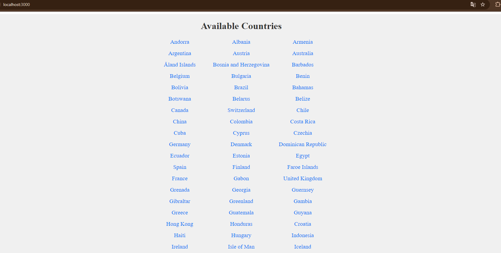
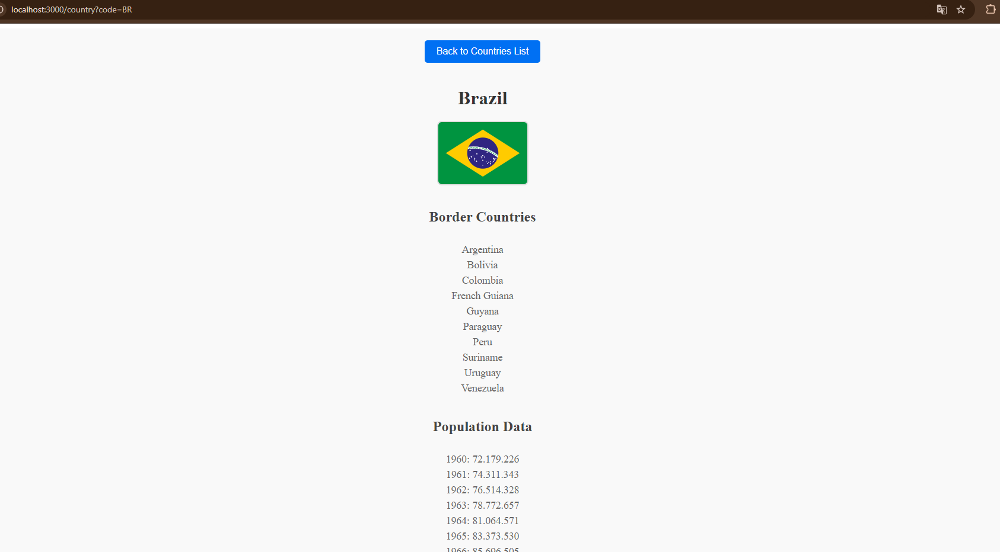

# 🌍 Country Info API - Backend

This is the frontend of the Country Info App, a web application that provides information about countries, including a list of available countries, demographics, borders, and flags. The project is built with React and Next.js and follows an organized structure with pages, components, and services.

## 📑 Table of Contents
Requirements
Installation
Running the Application
Environment Variables
Pages and Functionality
---

## ⚙️ Requirements

- **Node.js** v14+ (Node.js v21.6.1 recommended)
- **NPM** v6+

## 📥 Installation

1. **Clone the repository**:
   git clone git@github.com:LopesEduarda/Country-Info-App.git
   cd Country-Info-App/backend

## 📥 Install dependencies:

    npm install

## Set up environment variables:
Create a .env.local file in the frontend folder to specify the backend API URL:

    NEXT_PUBLIC_API_URL=http://localhost:5000/api

##   Running the Application
To start the application in development mode with Nodemon:

    npm run dev

The frontend will be available at http://localhost:3000.

## 📄 Pages and Functionality
The frontend consists of the following main pages and components:

Home Page (List of Countries):

Path: /
Description: Displays a list of all available countries, fetched from the backend API.
Functionality: Each country name is clickable, leading to the country’s detail page.
Country Detail Page:

Path: /country?code=COUNTRY_CODE
Description: Shows detailed information about a specific country, including:
Country Name: Displayed prominently at the top.
Country Flag: Displayed next to the country name.
Border Countries: A list of neighboring countries, each clickable to view that country’s details.
Population Data: A list of historical population data.
Back Button: Returns to the list of all countries.

Error Handling
The application gracefully handles errors by displaying appropriate messages when:

Data cannot be fetched due to network issues.
Invalid country codes are provided in the URL.
The backend API returns an error.

